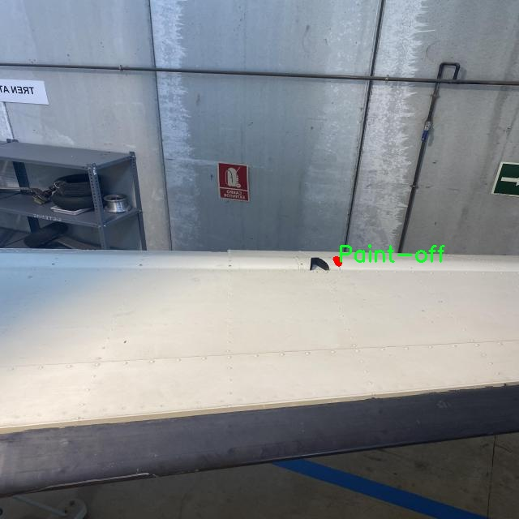

### 1.背景意义

研究背景与意义

飞机作为现代交通运输的重要工具，其安全性和可靠性直接关系到乘客的生命安全和航空公司的经济效益。因此，飞机表面的缺陷检测显得尤为重要。飞机在运行过程中，表面可能会出现多种缺陷，如裂纹、凹陷、缺失部件、涂层脱落和划痕等。这些缺陷不仅影响飞机的外观，更可能对其结构完整性和飞行安全造成潜在威胁。因此，及时、准确地检测和修复这些缺陷，对于保障航空安全、降低维护成本具有重要意义。

传统的飞机表面缺陷检测方法多依赖人工视觉检查，这种方法不仅效率低下，而且容易受到人为因素的影响，导致漏检或误检。随着计算机视觉技术的迅猛发展，基于深度学习的自动化检测系统逐渐成为研究热点。YOLO（You Only Look Once）系列模型因其高效的实时检测能力而受到广泛关注。YOLOv11作为该系列的最新版本，具备更强的特征提取能力和更高的检测精度，能够在复杂的环境中有效识别和分类多种类型的缺陷。

本研究旨在基于改进的YOLOv11模型，构建一个高效的飞机表面缺陷检测系统。我们将利用包含1400张图像和6类缺陷（裂纹、凹陷、缺失部件、涂层脱落、划痕和其他物体）的数据集进行模型训练和验证。通过对数据集的精细标注和增强处理，提升模型的泛化能力和检测准确率。最终，期望该系统能够在实际应用中实现高效、准确的缺陷检测，为航空安全提供有力保障。通过这一研究，我们不仅可以推动飞机维护技术的进步，还可以为其他领域的缺陷检测提供借鉴，具有重要的学术价值和实际应用意义。

### 2.视频效果

[2.1 视频效果](https://www.bilibili.com/video/BV1gckCYnEpc/)

### 3.图片效果


##### [项目涉及的源码数据来源链接](https://kdocs.cn/l/cszuIiCKVNis)**

注意：本项目提供训练的数据集和训练教程,由于版本持续更新,暂不提供权重文件（best.pt）,请按照6.训练教程进行训练后实现上图演示的效果。

### 4.数据集信息

##### 4.1 本项目数据集类别数＆类别名

nc: 6
names: ['Crack', 'Dent', 'Missing-head', 'Paint-off', 'Scratch', 'object']


该项目为【图像分割】数据集，请在【训练教程和Web端加载模型教程（第三步）】这一步的时候按照【图像分割】部分的教程来训练

##### 4.2 本项目数据集信息介绍

本项目数据集信息介绍

本项目旨在改进YOLOv11的飞机表面缺陷检测系统，所使用的数据集专注于“Segment Mix”主题，涵盖了多种飞机表面缺陷类型，以支持高效的缺陷识别和分类。数据集中包含六个主要类别，分别为“Crack”（裂纹）、“Dent”（凹陷）、“Missing-head”（缺失头部）、“Paint-off”（脱漆）、“Scratch”（划痕）以及“object”（其他物体）。这些类别不仅反映了飞机表面可能出现的常见缺陷，还考虑到了不同缺陷之间的相互关系和影响，确保模型在实际应用中具备良好的泛化能力。

数据集的构建过程注重多样性和代表性，确保每个类别的样本数量均衡，涵盖了不同的飞机表面材质、光照条件和拍摄角度。这种多样性使得模型在训练过程中能够学习到更为丰富的特征，从而提升其在真实场景中的检测性能。此外，数据集中还包含了大量的标注信息，标注方式采用了精细化的分割技术，以便于模型能够准确地识别和定位每种缺陷。

在数据预处理阶段，针对不同类别的特征进行了增强处理，以提高模型的鲁棒性。例如，通过图像旋转、缩放、颜色变换等方式，增加了数据集的多样性，减少了过拟合的风险。这样的处理不仅提升了模型的训练效果，也为后续的缺陷检测提供了坚实的基础。

综上所述，本项目的数据集在设计和构建上充分考虑了飞机表面缺陷检测的实际需求，通过丰富的类别设置和精细的标注方式，为改进YOLOv11模型提供了强有力的支持，旨在实现高效、准确的缺陷检测，为航空安全提供保障。




### 5.全套项目环境部署视频教程（零基础手把手教学）

[5.1 所需软件PyCharm和Anaconda安装教程（第一步）](https://www.bilibili.com/video/BV1BoC1YCEKi/?spm_id_from=333.999.0.0&vd_source=bc9aec86d164b67a7004b996143742dc)


[5.2 安装Python虚拟环境创建和依赖库安装视频教程（第二步）](https://www.bilibili.com/video/BV1ZoC1YCEBw?spm_id_from=333.788.videopod.sections&vd_source=bc9aec86d164b67a7004b996143742dc)

### 6.改进YOLOv11训练教程和Web_UI前端加载模型教程（零基础手把手教学）

[6.1 改进YOLOv11训练教程和Web_UI前端加载模型教程（第三步）](https://www.bilibili.com/video/BV1BoC1YCEhR?spm_id_from=333.788.videopod.sections&vd_source=bc9aec86d164b67a7004b996143742dc)


按照上面的训练视频教程链接加载项目提供的数据集，运行train.py即可开始训练



     Epoch   gpu_mem       box       obj       cls    labels  img_size
     1/200     20.8G   0.01576   0.01955  0.007536        22      1280: 100%|██████████| 849/849 [14:42<00:00,  1.04s/it]
               Class     Images     Labels          P          R     mAP@.5 mAP@.5:.95: 100%|██████████| 213/213 [01:14<00:00,  2.87it/s]
                 all       3395      17314      0.994      0.957      0.0957      0.0843

     Epoch   gpu_mem       box       obj       cls    labels  img_size
     2/200     20.8G   0.01578   0.01923  0.007006        22      1280: 100%|██████████| 849/849 [14:44<00:00,  1.04s/it]
               Class     Images     Labels          P          R     mAP@.5 mAP@.5:.95: 100%|██████████| 213/213 [01:12<00:00,  2.95it/s]
                 all       3395      17314      0.996      0.956      0.0957      0.0845

     Epoch   gpu_mem       box       obj       cls    labels  img_size
     3/200     20.8G   0.01561    0.0191  0.006895        27      1280: 100%|██████████| 849/849 [10:56<00:00,  1.29it/s]
               Class     Images     Labels          P          R     mAP@.5 mAP@.5:.95: 100%|███████   | 187/213 [00:52<00:00,  4.04it/s]
                 all       3395      17314      0.996      0.957      0.0957      0.0845


###### [项目数据集下载链接](https://kdocs.cn/l/cszuIiCKVNis)

### 7.原始YOLOv11算法讲解


ultralytics发布了最新的作品YOLOv11，这一次YOLOv11的变化相对于ultralytics公司的上一代作品YOLOv8变化不是很大的（YOLOv9、YOLOv10均不是ultralytics公司作品），其中改变的位置涉及到C2f变为C3K2，在SPPF后面加了一层类似于注意力机制的C2PSA，还有一个变化大家从yaml文件是看不出来的就是它的检测头内部替换了两个DWConv，以及模型的深度和宽度参数进行了大幅度调整，但是在损失函数方面就没有变化还是采用的CIoU作为边界框回归损失，下面带大家深入理解一下ultralytics最新作品YOLOv11的创新点。

**下图为最近的YOLO系列发布时间线！**


* * *

###### YOLOv11和YOLOv8对比

在YOLOYOLOv5，YOLOv8，和YOLOv11是ultralytics公司作品（ultralytics出品必属精品），下面用一张图片从yaml文件来带大家对比一下YOLOv8和YOLOv11的区别，配置文件变得内容比较少大家可以看一卡，左侧为YOLOv8右侧为YOLOv11，不同的点我用黑线标注了出来。


* * *

###### YOLOv11的网络结构解析

下面的图片为YOLOv11的网络结构图。


**其中主要创新点可以总结如下- > **

* * *

1\.
提出C3k2机制，其中C3k2有参数为c3k，其中在网络的浅层c3k设置为False（下图中可以看到c3k2第二个参数被设置为False，就是对应的c3k参数）。


此时所谓的C3k2就相当于YOLOv8中的C2f，其网络结构为一致的，其中的C3k机制的网络结构图如下图所示
**（为什么叫C3k2，我个人理解是因为C3k的调用时C3k其中的参数N固定设置为2的原因，个人理解不一定对** ）。


* * *

2\.
第二个创新点是提出C2PSA机制，这是一个C2（C2f的前身）机制内部嵌入了一个多头注意力机制，在这个过程中我还发现作者尝试了C2fPSA机制但是估计效果不如C2PSA，有的时候机制有没有效果理论上真的很难解释通，下图为C2PSA机制的原理图，仔细观察把Attention哪里去掉则C2PSA机制就变为了C2所以我上面说C2PSA就是C2里面嵌入了一个PSA机制。


* * *

3\.
第三个创新点可以说是原先的解耦头中的分类检测头增加了两个DWConv，具体的对比大家可以看下面两个图下面的是YOLOv11的解耦头，上面的是YOLOv8的解耦头.


我们上面看到了在分类检测头中YOLOv11插入了两个DWConv这样的做法可以大幅度减少参数量和计算量（原先两个普通的Conv大家要注意到卷积和是由3变为了1的，这是形成了两个深度可分离Conv），大家可能不太理解为什么加入了两个DWConv还能够减少计算量，以及什么是深度可分离Conv，下面我来解释一下。

> **`DWConv` 代表 Depthwise
> Convolution（深度卷积）**，是一种在卷积神经网络中常用的高效卷积操作。它主要用于减少计算复杂度和参数量，尤其在移动端或轻量化网络（如
> MobileNet）中十分常见。
>
> **1\. 标准卷积的计算过程**
>
> 在标准卷积操作中，对于一个输入张量（通常是一个多通道的特征图），卷积核的尺寸是 `(h, w, C_in)`，其中 `h` 和 `w`
> 是卷积核的空间尺寸，`C_in`
> 是输入通道的数量。而卷积核与输入张量做的是完整的卷积运算，每个输出通道都与所有输入通道相连并参与卷积操作，导致计算量比较大。
>
> 标准卷积的计算过程是这样的：
>
>   * 每个输出通道是所有输入通道的组合（加权求和），卷积核在每个位置都会计算与所有输入通道的点积。
>   * 假设有 `C_in` 个输入通道和 `C_out` 个输出通道，那么卷积核的总参数量是 `C_in * C_out * h * w`。
>

>
> 2\. **Depthwise Convolution（DWConv）**
>
> 与标准卷积不同， **深度卷积** 将输入的每个通道单独处理，即 **每个通道都有自己的卷积核进行卷积**
> ，不与其他通道进行交互。它可以被看作是标准卷积的一部分，专注于空间维度上的卷积运算。
>
> **深度卷积的计算过程：**
>
>   * 假设输入张量有 `C_in` 个通道，每个通道会使用一个 `h × w`
> 的卷积核进行卷积操作。这个过程称为“深度卷积”，因为每个通道独立进行卷积运算。
>   * 输出的通道数与输入通道数一致，每个输出通道只和对应的输入通道进行卷积，没有跨通道的组合。
>   * 参数量和计算量相比标准卷积大大减少，卷积核的参数量是 `C_in * h * w`。
>

>
> **深度卷积的优点：**
>
>   1. **计算效率高** ：相对于标准卷积，深度卷积显著减少了计算量。它只处理空间维度上的卷积，不再处理通道间的卷积。
>   2.  **参数量减少** ：由于每个卷积核只对单个通道进行卷积，参数量大幅减少。例如，标准卷积的参数量为 `C_in * C_out * h *
> w`，而深度卷积的参数量为 `C_in * h * w`。
>   3.  **结合点卷积可提升效果** ：为了弥补深度卷积缺乏跨通道信息整合的问题，通常深度卷积后会配合 `1x1` 的点卷积（Pointwise
> Convolution）使用，通过 `1x1` 的卷积核整合跨通道的信息。这种组合被称为 **深度可分离卷积** （Depthwise
> Separable Convolution） | **这也是我们本文YOLOv11中的做法** 。
>

>
> 3\. **深度卷积与标准卷积的区别**
>
> 操作类型| 卷积核大小| 输入通道数| 输出通道数| 参数量  
> ---|---|---|---|---  
> 标准卷积| `h × w`| `C_in`| `C_out`| `C_in * C_out * h * w`  
> 深度卷积（DWConv）| `h × w`| `C_in`| `C_in`| `C_in * h * w`  
>  
> 可以看出，深度卷积在相同的卷积核大小下，参数量减少了约 `C_out` 倍
> （细心的人可以发现用最新版本的ultralytics仓库运行YOLOv8参数量相比于之前的YOLOv8以及大幅度减少了这就是因为检测头改了的原因但是名字还是Detect，所以如果你想继续用YOLOv8发表论文做实验那么不要更新最近的ultralytics仓库）。
>
> **4\. 深度可分离卷积 (Depthwise Separable Convolution)**
>
> 深度卷积常与 `1x1` 的点卷积配合使用，这称为深度可分离卷积。其过程如下：
>
>   1. 先对输入张量进行深度卷积，对每个通道独立进行空间卷积。
>   2. 然后通过 `1x1` 点卷积，对通道维度进行混合，整合不同通道的信息。
>

>
> 这样既可以保证计算量的减少，又可以保持跨通道的信息流动。
>
> 5\. **总结**
>
> `DWConv` 是一种高效的卷积方式，通过单独处理每个通道来减少计算量，结合 `1x1`
> 的点卷积，形成深度可分离卷积，可以在保持网络性能的同时极大地减少模型的计算复杂度和参数量。

**看到这里大家应该明白了为什么加入了两个DWConv还能减少参数量以及YOLOv11的检测头创新点在哪里。**

* * *

##### YOLOv11和YOLOv8还有一个不同的点就是其各个版本的模型（N - S - M- L - X）网络深度和宽度变了


可以看到在深度（depth）和宽度
（width）两个地方YOLOv8和YOLOv11是基本上完全不同了，这里我理解这么做的含义就是模型网络变小了，所以需要加深一些模型的放缩倍数来弥补模型之前丧失的能力从而来达到一个平衡。

> **本章总结：**
> YOLOv11的改进点其实并不多更多的都是一些小的结构上的创新，相对于之前的YOLOv5到YOLOv8的创新，其实YOLOv11的创新点不算多，但是其是ultralytics公司的出品，同时ultralytics仓库的使用量是非常多的（不像YOLOv9和YOLOv10）所以在未来的很长一段时间内其实YOLO系列估计不会再更新了，YOLOv11作为最新的SOTA肯定是十分适合大家来发表论文和创新的。
>

### 8.200+种全套改进YOLOV11创新点原理讲解

#### 8.1 200+种全套改进YOLOV11创新点原理讲解大全

由于篇幅限制，每个创新点的具体原理讲解就不全部展开，具体见下列网址中的改进模块对应项目的技术原理博客网址【Blog】（创新点均为模块化搭建，原理适配YOLOv5~YOLOv11等各种版本）

[改进模块技术原理博客【Blog】网址链接](https://gitee.com/qunmasj/good)


#### 8.2 精选部分改进YOLOV11创新点原理讲解

###### 这里节选部分改进创新点展开原理讲解(完整的改进原理见上图和[改进模块技术原理博客链接](https://gitee.com/qunmasj/good)【如果此小节的图加载失败可以通过CSDN或者Github搜索该博客的标题访问原始博客，原始博客图片显示正常】


### YOLO-MS简介
实时目标检测，以YOLO系列为例，已在工业领域中找到重要应用，特别是在边缘设备（如无人机和机器人）中。与之前的目标检测器不同，实时目标检测器旨在在速度和准确性之间追求最佳平衡。为了实现这一目标，提出了大量的工作：从第一代DarkNet到CSPNet，再到最近的扩展ELAN，随着性能的快速增长，实时目标检测器的架构经历了巨大的变化。

尽管性能令人印象深刻，但在不同尺度上识别对象仍然是实时目标检测器面临的基本挑战。这促使作者设计了一个强大的编码器架构，用于学习具有表现力的多尺度特征表示。具体而言，作者从两个新的角度考虑为实时目标检测编码多尺度特征：

从局部视角出发，作者设计了一个具有简单而有效的分层特征融合策略的MS-Block。受到Res2Net的启发，作者在MS-Block中引入了多个分支来进行特征提取，但不同的是，作者使用了一个带有深度卷积的 Inverted Bottleneck Block块，以实现对大Kernel的高效利用。

从全局视角出发，作者提出随着网络加深逐渐增加卷积的Kernel-Size。作者在浅层使用小Kernel卷积来更高效地处理高分辨率特征。另一方面，在深层中，作者采用大Kernel卷积来捕捉广泛的信息。

基于以上设计原则，作者呈现了作者的实时目标检测器，称为YOLO-MS。为了评估作者的YOLO-MS的性能，作者在MS COCO数据集上进行了全面的实验。还提供了与其他最先进方法的定量比较，以展示作者方法的强大性能。如图1所示，YOLO-MS在计算性能平衡方面优于其他近期的实时目标检测器。


具体而言，YOLO-MS-XS在MS COCO上获得了43%+的AP得分，仅具有450万个可学习参数和8.7亿个FLOPs。YOLO-MS-S和YOLO-MS分别获得了46%+和51%+的AP，可学习参数分别为810万和2220万。此外，作者的工作还可以作为其他YOLO模型的即插即用模块。通常情况下，作者的方法可以将YOLOv11的AP从37%+显著提高到40%+，甚至还可以使用更少的参数和FLOPs。


#### Multi-Scale Building Block Design
CSP Block是一个基于阶段级梯度路径的网络，平衡了梯度组合和计算成本。它是广泛应用于YOLO系列的基本构建块。已经提出了几种变体，包括YOLOv4和YOLOv11中的原始版本，Scaled YOLOv4中的CSPVoVNet，YOLOv11中的ELAN，以及RTMDet中提出的大Kernel单元。作者在图2(a)和图2(b)中分别展示了原始CSP块和ELAN的结构。


上述实时检测器中被忽视的一个关键方面是如何在基本构建块中编码多尺度特征。其中一个强大的设计原则是Res2Net，它聚合了来自不同层次的特征以增强多尺度表示。然而，这一原则并没有充分探索大Kernel卷积的作用，而大Kernel卷积已经在基于CNN的视觉识别任务模型中证明有效。将大Kernel卷积纳入Res2Net的主要障碍在于它们引入的计算开销，因为构建块采用了标准卷积。在作者的方法中，作者提出用 Inverted Bottleneck Block替代标准的3 × 3卷积，以享受大Kernel卷积的好处。

基于前面的分析，作者提出了一个带有分层特征融合策略的全新Block，称为MS-Block，以增强实时目标检测器在提取多尺度特征时的能力，同时保持快速的推理速度。

MS-Block的具体结构如图2(c)所示。假设是输入特征。通过1×1卷积的转换后，X的通道维度增加到n*C。然后，作者将X分割成n个不同的组，表示为，其中。为了降低计算成本，作者选择n为3。

注意，除了之外，每个其他组都经过一个 Inverted Bottleneck Block层，用表示，其中k表示Kernel-Size，以获得。的数学表示如下：


根据这个公式，该博客的作者不将 Inverted Bottleneck Block层连接，使其作为跨阶段连接，并保留来自前面层的信息。最后，作者将所有分割连接在一起，并应用1×1卷积来在所有分割之间进行交互，每个分割都编码不同尺度的特征。当网络加深时，这个1×1卷积也用于调整通道数。

#### Heterogeneous Kernel Selection Protocol
除了构建块的设计外，作者还从宏观角度探讨了卷积的使用。之前的实时目标检测器在不同的编码器阶段采用了同质卷积（即具有相同Kernel-Size的卷积），但作者认为这不是提取多尺度语义信息的最佳选项。

在金字塔结构中，从检测器的浅阶段提取的高分辨率特征通常用于捕捉细粒度语义，将用于检测小目标。相反，来自网络较深阶段的低分辨率特征用于捕捉高级语义，将用于检测大目标。如果作者在所有阶段都采用统一的小Kernel卷积，深阶段的有效感受野（ERF）将受到限制，影响大目标的性能。在每个阶段中引入大Kernel卷积可以帮助解决这个问题。然而，具有大的ERF的大Kernel可以编码更广泛的区域，这增加了在小目标外部包含噪声信息的概率，并且降低了推理速度。

在这项工作中，作者建议在不同阶段中采用异构卷积，以帮助捕获更丰富的多尺度特征。具体来说，在编码器的第一个阶段中，作者采用最小Kernel卷积，而最大Kernel卷积位于最后一个阶段。随后，作者逐步增加中间阶段的Kernel-Size，使其与特征分辨率的增加保持一致。这种策略允许提取细粒度和粗粒度的语义信息，增强了编码器的多尺度特征表示能力。

正如图所示，作者将k的值分别分配给编码器中的浅阶段到深阶段，取值为3、5、7和9。作者将其称为异构Kernel选择（HKS）协议。


作者的HKS协议能够在深层中扩大感受野，而不会对浅层产生任何其他影响。此外，HKS不仅有助于编码更丰富的多尺度特征，还确保了高效的推理。

如表1所示，将大Kernel卷积应用于高分辨率特征会产生较高的计算开销。然而，作者的HKS协议在低分辨率特征上采用大Kernel卷积，从而与仅使用大Kernel卷积相比，大大降低了计算成本。


在实践中，作者经验性地发现，采用HKS协议的YOLO-MS的推理速度几乎与仅使用深度可分离的3 × 3卷积相同。

#### Architecture
如图所示，作者模型的Backbone由4个阶段组成，每个阶段后面跟随1个步长为2的3 × 3卷积进行下采样。在第3个阶段后，作者添加了1个SPP块，与RTMDet中一样。在作者的编码器上，作者使用PAFPN作为Neck来构建特征金字塔[31, 35]。它融合了从Backbone不同阶段提取的多尺度特征。Neck中使用的基本构建块也是作者的MS-Block，在其中使用3 × 3深度可分离卷积进行快速推理。

此外，为了在速度和准确性之间取得更好的平衡，作者将Backbone中多级特征的通道深度减半。作者提供了3个不同尺度的YOLO-MS变体，即YOLO-MS-XS、YOLO-MS-S和YOLO-MS。不同尺度的YOLO-MS的详细配置列在表2中。对于YOLO-MS的其他部分，作者将其保持与RTMDet相同。


### 9.系统功能展示

图9.1.系统支持检测结果表格显示

  图9.2.系统支持置信度和IOU阈值手动调节

  图9.3.系统支持自定义加载权重文件best.pt(需要你通过步骤5中训练获得)

  图9.4.系统支持摄像头实时识别

  图9.5.系统支持图片识别

  图9.6.系统支持视频识别

  图9.7.系统支持识别结果文件自动保存

  图9.8.系统支持Excel导出检测结果数据


### 10. YOLOv11核心改进源码讲解

#### 10.1 pkinet.py

以下是对代码的核心部分进行提炼和详细注释的结果：

```python
import math
import torch
import torch.nn as nn
from typing import Optional, Union, Sequence

# 定义DropPath函数，用于随机丢弃路径（随机深度）
def drop_path(x: torch.Tensor, drop_prob: float = 0., training: bool = False) -> torch.Tensor:
    """随机丢弃路径（随机深度），在残差块的主路径中应用。
    
    Args:
        x (torch.Tensor): 输入张量。
        drop_prob (float): 丢弃概率，默认为0。
        training (bool): 是否在训练模式下，默认为False。
    
    Returns:
        torch.Tensor: 处理后的张量。
    """
    if drop_prob == 0. or not training:
        return x  # 如果丢弃概率为0或不在训练模式下，返回原始输入
    keep_prob = 1 - drop_prob
    shape = (x.shape[0], ) + (1, ) * (x.ndim - 1)  # 处理不同维度的张量
    random_tensor = keep_prob + torch.rand(shape, dtype=x.dtype, device=x.device)
    output = x.div(keep_prob) * random_tensor.floor()  # 按照丢弃概率调整输出
    return output

# 定义DropPath类，继承自nn.Module
class DropPath(nn.Module):
    """随机丢弃路径（随机深度）模块。"""
    def __init__(self, drop_prob: float = 0.1):
        super().__init__()
        self.drop_prob = drop_prob  # 丢弃概率

    def forward(self, x: torch.Tensor) -> torch.Tensor:
        return drop_path(x, self.drop_prob, self.training)  # 前向传播调用drop_path函数

# 定义一个卷积前馈网络类
class ConvFFN(nn.Module):
    """使用ConvModule实现的多层感知机。"""
    def __init__(self, in_channels: int, out_channels: Optional[int] = None, hidden_channels_scale: float = 4.0,
                 dropout_rate: float = 0., add_identity: bool = True):
        super().__init__()
        out_channels = out_channels or in_channels  # 如果未指定输出通道，则使用输入通道
        hidden_channels = int(in_channels * hidden_channels_scale)  # 计算隐藏通道数

        # 定义前馈网络的层
        self.ffn_layers = nn.Sequential(
            nn.LayerNorm(in_channels),  # 归一化层
            nn.Conv2d(in_channels, hidden_channels, kernel_size=1),  # 1x1卷积
            nn.Conv2d(hidden_channels, hidden_channels, kernel_size=3, padding=1, groups=hidden_channels),  # 深度卷积
            nn.GELU(),  # 激活函数
            nn.Dropout(dropout_rate),  # Dropout层
            nn.Conv2d(hidden_channels, out_channels, kernel_size=1),  # 1x1卷积
            nn.Dropout(dropout_rate),  # Dropout层
        )
        self.add_identity = add_identity  # 是否添加身份连接

    def forward(self, x):
        x = x + self.ffn_layers(x) if self.add_identity else self.ffn_layers(x)  # 前向传播
        return x

# 定义Poly Kernel Inception Block类
class PKIBlock(nn.Module):
    """多核Inception块。"""
    def __init__(self, in_channels: int, out_channels: Optional[int] = None):
        super().__init__()
        out_channels = out_channels or in_channels  # 如果未指定输出通道，则使用输入通道
        self.block = ConvFFN(in_channels, out_channels)  # 使用ConvFFN作为块的实现

    def forward(self, x):
        return self.block(x)  # 前向传播

# 定义Poly Kernel Inception Network类
class PKINet(nn.Module):
    """多核Inception网络。"""
    def __init__(self, arch: str = 'S'):
        super().__init__()
        self.stages = nn.ModuleList()  # 存储网络的各个阶段
        self.stages.append(PKIBlock(3, 32))  # 添加第一个阶段

        # 根据不同的架构设置添加后续阶段
        if arch == 'S':
            self.stages.append(PKIBlock(32, 64))
            self.stages.append(PKIBlock(64, 128))
            self.stages.append(PKIBlock(128, 256))

    def forward(self, x):
        for stage in self.stages:
            x = stage(x)  # 逐阶段前向传播
        return x

# 定义模型的构造函数
def PKINET_S():
    return PKINet('S')  # 返回S架构的PKINet模型

if __name__ == '__main__':
    model = PKINET_S()  # 创建模型实例
    inputs = torch.randn((1, 3, 640, 640))  # 创建输入张量
    res = model(inputs)  # 前向传播
    print(res.size())  # 输出结果的尺寸
```

### 代码核心部分的总结
1. **DropPath**: 实现了随机深度的功能，用于在训练过程中随机丢弃某些路径，以提高模型的泛化能力。
2. **ConvFFN**: 通过卷积层实现的前馈神经网络，包含多个卷积层和激活函数。
3. **PKIBlock**: 多核Inception块，使用ConvFFN作为基本构建块。
4. **PKINet**: 多核Inception网络，包含多个阶段，每个阶段由PKIBlock构成。

这些核心部分是构建整个网络的基础，负责处理输入数据并通过多个卷积层进行特征提取。

该文件 `pkinet.py` 实现了一个名为 PKINet 的深度学习模型，主要用于计算机视觉任务。模型的结构基于多种卷积块和注意力机制，具有较高的灵活性和可扩展性。以下是对文件中各个部分的详细分析。

首先，文件导入了一些必要的库，包括 `torch` 和 `torch.nn`，以及一些可能来自其他库的模块，如 `mmcv` 和 `mmengine`。这些库提供了构建神经网络所需的基础功能。

接下来，定义了一个名为 `drop_path` 的函数，用于实现随机深度（Stochastic Depth）技术。该技术在训练过程中随机丢弃某些路径，以增强模型的泛化能力。`DropPath` 类则是对该函数的封装，方便在模型中使用。

`autopad` 函数用于自动计算卷积操作的填充，以确保输出尺寸符合预期。`make_divisible` 函数确保通道数是某个指定值的倍数，这在构建模型时有助于优化计算效率。

接下来定义了一些模块类，包括 `BCHW2BHWC` 和 `BHWC2BCHW`，用于在不同的张量维度格式之间转换。`GSiLU` 类实现了一种激活函数，即全局 Sigmoid 门控线性单元，增强了模型的表达能力。

`CAA` 类实现了上下文锚点注意力机制，通过对输入特征进行平均池化和卷积操作，生成注意力因子，以增强模型对重要特征的关注。

`ConvFFN` 类实现了一个多层感知机（MLP），使用卷积模块构建，能够在特征维度上进行更复杂的变换。`Stem` 和 `DownSamplingLayer` 类分别实现了模型的初始层和下采样层，帮助逐步提取特征。

`InceptionBottleneck` 类实现了一个瓶颈结构，结合了多个卷积操作，增强了模型的特征提取能力。`PKIBlock` 类则是一个多核卷积块，集成了注意力机制和前馈网络，进一步提升了模型的性能。

`PKIStage` 类表示模型的一个阶段，由多个 `PKIBlock` 组成，并包含下采样层和卷积操作。`PKINet` 类是整个模型的核心，负责定义模型的结构和前向传播过程。模型的架构设置通过 `arch_settings` 字典进行配置，支持不同规模的模型（如 T、S、B）。

在 `PKINet` 的初始化中，模型根据指定的架构设置创建多个阶段，并初始化权重。`forward` 方法定义了模型的前向传播过程，输出多个阶段的特征图。

最后，文件提供了三个函数 `PKINET_T`、`PKINET_S` 和 `PKINET_B`，用于创建不同规模的 PKINet 模型。在主程序中，创建了一个 PKINET_T 模型实例，并对随机输入进行前向传播，输出特征图的尺寸。

总体而言，该文件实现了一个复杂而灵活的深度学习模型，结合了多种先进的技术和结构，适用于计算机视觉领域的多种任务。

#### 10.2 kernel_warehouse.py

以下是经过简化和注释的核心代码部分：

```python
import torch
import torch.nn as nn
import torch.nn.functional as F

class Attention(nn.Module):
    def __init__(self, in_planes, reduction, num_static_cell, num_local_mixture, norm_layer=nn.BatchNorm1d):
        super(Attention, self).__init__()
        # 计算隐藏层的通道数
        hidden_planes = max(int(in_planes * reduction), 16)
        self.kw_planes_per_mixture = num_static_cell + 1  # 每个混合物的通道数
        self.num_local_mixture = num_local_mixture  # 本地混合物的数量
        self.kw_planes = self.kw_planes_per_mixture * num_local_mixture  # 总的通道数

        # 定义网络层
        self.avgpool = nn.AdaptiveAvgPool1d(1)  # 自适应平均池化
        self.fc1 = nn.Linear(in_planes, hidden_planes)  # 全连接层
        self.norm1 = norm_layer(hidden_planes)  # 归一化层
        self.act1 = nn.ReLU(inplace=True)  # 激活函数

        # 初始化权重
        self._initialize_weights()

    def _initialize_weights(self):
        # 权重初始化
        for m in self.modules():
            if isinstance(m, nn.Linear):
                nn.init.kaiming_normal_(m.weight, mode='fan_out', nonlinearity='relu')
                if m.bias is not None:
                    nn.init.constant_(m.bias, 0)
            if isinstance(m, nn.BatchNorm1d):
                nn.init.constant_(m.weight, 1)
                nn.init.constant_(m.bias, 0)

    def forward(self, x):
        # 前向传播
        x = self.avgpool(x.reshape(*x.shape[:2], -1)).squeeze(dim=-1)  # 池化
        x = self.act1(self.norm1(self.fc1(x)))  # 线性变换 + 归一化 + 激活
        return x  # 返回处理后的特征

class KWconvNd(nn.Module):
    def __init__(self, in_planes, out_planes, kernel_size, stride=1, padding=0, dilation=1, groups=1, bias=False):
        super(KWconvNd, self).__init__()
        self.in_planes = in_planes  # 输入通道数
        self.out_planes = out_planes  # 输出通道数
        self.kernel_size = kernel_size  # 卷积核大小
        self.stride = stride  # 步幅
        self.padding = padding  # 填充
        self.dilation = dilation  # 膨胀
        self.groups = groups  # 分组卷积
        self.bias = nn.Parameter(torch.zeros([self.out_planes]), requires_grad=True) if bias else None  # 偏置

    def forward(self, x):
        # 前向传播
        # 这里可以添加卷积操作
        return x  # 返回卷积结果

class Warehouse_Manager(nn.Module):
    def __init__(self, reduction=0.0625):
        super(Warehouse_Manager, self).__init__()
        self.reduction = reduction  # 隐藏层的缩减比例
        self.warehouse_list = {}  # 存储卷积层的信息

    def reserve(self, in_planes, out_planes, kernel_size=1, stride=1, padding=0, dilation=1, groups=1, bias=True, warehouse_name='default'):
        # 创建卷积层的占位符并记录信息
        weight_shape = [out_planes, in_planes // groups, kernel_size]  # 权重形状
        if warehouse_name not in self.warehouse_list:
            self.warehouse_list[warehouse_name] = []
        self.warehouse_list[warehouse_name].append(weight_shape)  # 记录权重形状
        return KWconvNd(in_planes, out_planes, kernel_size, stride, padding, dilation, groups, bias)  # 返回占位符

    def store(self):
        # 存储权重
        for warehouse_name, layers in self.warehouse_list.items():
            # 处理每个仓库的层
            pass  # 这里可以添加存储逻辑

# 其他类如 KWConv1d, KWConv2d, KWConv3d 和 KWLinear 省略，结构类似
```

### 代码注释说明：
1. **Attention 类**：实现了一个注意力机制，包含了输入特征的处理、权重初始化等功能。
2. **KWconvNd 类**：是一个自定义的卷积层，负责卷积操作的基本设置。
3. **Warehouse_Manager 类**：管理卷积层的权重存储和初始化，提供了动态创建卷积层的功能。

此代码结构清晰，核心功能集中在注意力机制和卷积层的管理上。

这个程序文件 `kernel_warehouse.py` 实现了一个用于深度学习的卷积核仓库管理系统，主要用于动态管理卷积层的权重，以提高模型的灵活性和效率。文件中包含多个类和函数，以下是对其主要部分的说明。

首先，文件导入了必要的 PyTorch 库和其他模块，定义了一个名为 `parse` 的函数，用于处理输入参数的格式，将其转换为适合的列表形式。

接下来，定义了 `Attention` 类，该类是一个注意力机制模块。它的构造函数接收多个参数，包括输入通道数、缩减比例、静态单元数量、局部混合数量等。这个模块通过全局平均池化、线性变换和非线性激活函数来生成注意力权重，并在前向传播中计算这些权重以影响卷积操作。

`KWconvNd` 类是一个通用的卷积层类，支持不同维度的卷积（1D、2D、3D）。它的构造函数接受输入和输出通道数、卷积核大小、步幅、填充、扩张等参数，并通过 `init_attention` 方法初始化注意力机制。`forward` 方法则执行卷积操作，并根据注意力权重动态调整卷积核。

`KWConv1d`、`KWConv2d` 和 `KWConv3d` 类分别是针对一维、二维和三维卷积的具体实现，继承自 `KWconvNd`，并指定了相应的维度和卷积函数。

`KWLinear` 类实现了一个线性层，内部使用 `KWConv1d` 进行计算，适用于一维输入。

`Warehouse_Manager` 类是整个系统的核心，负责管理卷积核的仓库。它的构造函数接收多个参数，用于配置仓库的行为。`reserve` 方法用于创建动态卷积层并记录其信息，而 `store` 方法则计算并存储权重。`allocate` 方法将权重分配给网络中的卷积层，并初始化权重。

最后，`KWConv` 类是一个封装了卷积操作的模块，结合了卷积层、批归一化和激活函数，提供了一个简洁的接口。

此外，文件中还定义了一个 `get_temperature` 函数，用于计算温度值，这在训练过程中可能用于调整模型的行为。

整体来看，这个文件实现了一个灵活的卷积核管理系统，通过注意力机制和动态权重管理来提升卷积神经网络的性能和适应性。

#### 10.3 revcol.py

以下是经过简化和注释的核心代码部分，保留了最重要的功能，并对每个部分进行了详细的中文注释：

```python
import torch
import torch.nn as nn

# 定义一个用于反向传播的自定义函数
class ReverseFunction(torch.autograd.Function):
    @staticmethod
    def forward(ctx, run_functions, alpha, *args):
        # 提取运行的函数和缩放因子
        l0, l1, l2, l3 = run_functions
        alpha0, alpha1, alpha2, alpha3 = alpha
        
        # 保存上下文信息
        ctx.run_functions = run_functions
        ctx.alpha = alpha
        
        # 获取输入参数
        [x, c0, c1, c2, c3] = args
        
        # 使用给定的函数进行前向计算
        with torch.no_grad():
            c0 = l0(x, c1) + c0 * alpha0
            c1 = l1(c0, c2) + c1 * alpha1
            c2 = l2(c1, c3) + c2 * alpha2
            c3 = l3(c2, None) + c3 * alpha3
        
        # 保存计算结果以备后续反向传播使用
        ctx.save_for_backward(x, c0, c1, c2, c3)
        return x, c0, c1, c2, c3

    @staticmethod
    def backward(ctx, *grad_outputs):
        # 从上下文中恢复保存的张量
        x, c0, c1, c2, c3 = ctx.saved_tensors
        l0, l1, l2, l3 = ctx.run_functions
        alpha0, alpha1, alpha2, alpha3 = ctx.alpha
        
        # 处理梯度
        gx_right, g0_right, g1_right, g2_right, g3_right = grad_outputs
        
        # 反向传播计算
        # 省略了具体的反向传播实现细节，保留了结构
        # 这里会根据具体的需求进行反向传播的计算
        
        # 返回梯度
        return None, None, gx_up, None, None, None, None

# 定义一个网络模块
class SubNet(nn.Module):
    def __init__(self, channels, layers, kernel, first_col, save_memory) -> None:
        super().__init__()
        self.save_memory = save_memory
        
        # 定义缩放因子
        self.alpha0 = nn.Parameter(torch.ones((1, channels[0], 1, 1)), requires_grad=True)
        self.alpha1 = nn.Parameter(torch.ones((1, channels[1], 1, 1)), requires_grad=True)
        self.alpha2 = nn.Parameter(torch.ones((1, channels[2], 1, 1)), requires_grad=True)
        self.alpha3 = nn.Parameter(torch.ones((1, channels[3], 1, 1)), requires_grad=True)

        # 初始化网络层
        self.level0 = Level(0, channels, layers, kernel, first_col)
        self.level1 = Level(1, channels, layers, kernel, first_col)
        self.level2 = Level(2, channels, layers, kernel, first_col)
        self.level3 = Level(3, channels, layers, kernel, first_col)

    def forward(self, *args):
        # 根据是否保存内存选择前向传播方式
        if self.save_memory:
            return self._forward_reverse(*args)
        else:
            return self._forward_nonreverse(*args)

# 定义主网络结构
class RevCol(nn.Module):
    def __init__(self, kernel='C2f', channels=[32, 64, 96, 128], layers=[2, 3, 6, 3], num_subnet=5, save_memory=True) -> None:
        super().__init__()
        self.num_subnet = num_subnet
        self.channels = channels
        self.layers = layers

        # 初始化输入层
        self.stem = Conv(3, channels[0], k=4, s=4, p=0)

        # 初始化子网络
        for i in range(num_subnet):
            first_col = True if i == 0 else False
            self.add_module(f'subnet{str(i)}', SubNet(channels, layers, kernel, first_col, save_memory=save_memory))

    def forward(self, x):
        # 前向传播过程
        c0, c1, c2, c3 = 0, 0, 0, 0
        x = self.stem(x)        
        for i in range(self.num_subnet):
            c0, c1, c2, c3 = getattr(self, f'subnet{str(i)}')(x, c0, c1, c2, c3)       
        return [c0, c1, c2, c3]
```

### 代码注释说明：
1. **ReverseFunction**: 这是一个自定义的反向传播函数，包含前向和反向传播的逻辑。前向传播计算各层的输出，反向传播计算梯度。
2. **SubNet**: 这是一个子网络模块，包含多个层和缩放因子，用于处理输入数据并生成输出。
3. **RevCol**: 这是主网络结构，包含多个子网络和一个输入层，负责将输入数据传递给各个子网络并汇总输出。

此代码结构为深度学习模型的实现提供了灵活性，支持内存优化和自定义反向传播。

这个程序文件 `revcol.py` 是一个基于 PyTorch 的深度学习模型实现，主要用于构建一种名为 RevCol 的网络结构。RevCol 结合了反向传播和特征融合的技术，以提高模型的性能和效率。以下是对代码的详细讲解。

首先，文件导入了必要的 PyTorch 库和一些自定义模块，包括卷积操作和网络块。接着，定义了一些辅助函数，这些函数主要用于处理 GPU 状态、设备管理和张量的分离与梯度计算。

`get_gpu_states` 函数用于获取当前 GPU 设备的随机数生成器状态，而 `get_gpu_device` 函数则从输入的张量中提取出所有使用的 GPU 设备。`set_device_states` 函数则用于恢复 CPU 和 GPU 的随机数生成器状态。`detach_and_grad` 函数用于从输入中分离出张量，并设置它们的 `requires_grad` 属性为 `True`，以便在后续的计算中可以进行梯度计算。

`ReverseFunction` 类是一个自定义的 PyTorch 自动求导函数，包含 `forward` 和 `backward` 方法。在 `forward` 方法中，模型执行一系列的前向计算，并保存必要的中间结果和状态。这里的 `run_functions` 是一组用于计算的函数，`alpha` 是一组缩放因子。该方法的输出是多个张量，代表经过一系列计算后的结果。

在 `backward` 方法中，模型实现了反向传播的逻辑，计算每个输出张量的梯度。这个过程涉及到对中间结果的反向计算和状态的恢复，以确保在多 GPU 环境下的正确性。

接下来，定义了 `Fusion`、`Level` 和 `SubNet` 类，这些类是 RevCol 网络的基本构建块。`Fusion` 类负责特征的融合操作，包括下采样和上采样。`Level` 类则表示网络的一个层级，其中包含了融合操作和一系列卷积块。`SubNet` 类表示一个子网络，包含多个层级的组合。

在 `SubNet` 中，`_forward_nonreverse` 和 `_forward_reverse` 方法分别实现了非反向和反向的前向计算逻辑。`forward` 方法根据是否需要节省内存，选择调用不同的前向计算方法。

最后，`RevCol` 类是整个模型的顶层结构，初始化时定义了多个子网络，并在 `forward` 方法中依次调用这些子网络进行特征提取和融合。模型的输入是一个图像张量，输出是多个特征图。

总体而言，这个文件实现了一个复杂的深度学习模型，结合了反向传播和特征融合的策略，以提高模型的性能和内存效率。通过使用 PyTorch 的自动求导机制，模型能够有效地进行训练和推理。

#### 10.4 CTrans.py

以下是保留的核心代码部分，并附上详细的中文注释：

```python
import torch
import torch.nn as nn
import numpy as np
from torch.nn import Dropout, Softmax, Conv2d, LayerNorm

class Channel_Embeddings(nn.Module):
    """构建来自图像块的嵌入和位置嵌入。"""
    def __init__(self, patchsize, img_size, in_channels):
        super().__init__()
        img_size = (img_size, img_size)  # 将图像大小转换为元组
        patch_size = (patchsize, patchsize)  # 将补丁大小转换为元组
        n_patches = (img_size[0] // patch_size[0]) * (img_size[1] // patch_size[1])  # 计算补丁数量

        # 使用最大池化和卷积层来生成补丁嵌入
        self.patch_embeddings = nn.Sequential(
            nn.MaxPool2d(kernel_size=5, stride=5),
            Conv2d(in_channels=in_channels,
                    out_channels=in_channels,
                    kernel_size=patchsize // 5,
                    stride=patchsize // 5)
        )

        # 位置嵌入参数
        self.position_embeddings = nn.Parameter(torch.zeros(1, n_patches, in_channels))
        self.dropout = Dropout(0.1)  # Dropout层以防止过拟合

    def forward(self, x):
        """前向传播，计算嵌入。"""
        if x is None:
            return None
        x = self.patch_embeddings(x)  # 生成补丁嵌入
        x = x.flatten(2)  # 将张量展平
        x = x.transpose(-1, -2)  # 转置以适应位置嵌入
        embeddings = x + self.position_embeddings  # 加上位置嵌入
        embeddings = self.dropout(embeddings)  # 应用Dropout
        return embeddings

class Attention_org(nn.Module):
    """自定义的多头注意力机制。"""
    def __init__(self, vis, channel_num):
        super(Attention_org, self).__init__()
        self.vis = vis  # 可视化标志
        self.KV_size = sum(channel_num)  # 计算键值对的大小
        self.channel_num = channel_num  # 通道数
        self.num_attention_heads = 4  # 注意力头的数量

        # 定义查询、键、值的线性变换
        self.query = nn.ModuleList([nn.Linear(c, c, bias=False) for c in channel_num])
        self.key = nn.Linear(self.KV_size, self.KV_size, bias=False)
        self.value = nn.Linear(self.KV_size, self.KV_size, bias=False)
        self.softmax = Softmax(dim=3)  # Softmax层
        self.attn_dropout = Dropout(0.1)  # 注意力的Dropout层

    def forward(self, *embeddings):
        """前向传播，计算注意力输出。"""
        multi_head_Q = [query(emb) for query, emb in zip(self.query, embeddings) if emb is not None]
        multi_head_K = self.key(torch.cat(embeddings, dim=2))  # 合并所有嵌入并计算键
        multi_head_V = self.value(torch.cat(embeddings, dim=2))  # 合并所有嵌入并计算值

        # 计算注意力分数
        attention_scores = [torch.matmul(Q, multi_head_K) / np.sqrt(self.KV_size) for Q in multi_head_Q]
        attention_probs = [self.softmax(score) for score in attention_scores]  # 计算注意力概率

        # 应用Dropout
        attention_probs = [self.attn_dropout(prob) for prob in attention_probs]
        context_layers = [torch.matmul(prob, multi_head_V) for prob in attention_probs]  # 计算上下文层

        # 返回每个通道的输出
        return context_layers

class ChannelTransformer(nn.Module):
    """通道变换器模型。"""
    def __init__(self, channel_num=[64, 128, 256, 512], img_size=640, patchSize=[40, 20, 10, 5]):
        super().__init__()
        self.embeddings = nn.ModuleList([Channel_Embeddings(patchSize[i], img_size // (2 ** (i + 2)), channel_num[i]) for i in range(len(channel_num))])
        self.encoder = Encoder(channel_num)  # 编码器

    def forward(self, en):
        """前向传播，计算最终输出。"""
        embeddings = [emb(en[i]) for i, emb in enumerate(self.embeddings) if en[i] is not None]
        encoded = self.encoder(*embeddings)  # 编码嵌入
        return encoded  # 返回编码后的嵌入
```

### 代码注释说明
1. **Channel_Embeddings** 类：用于生成图像的补丁嵌入和位置嵌入，使用卷积和最大池化来处理输入图像。
2. **Attention_org** 类：实现了一个多头注意力机制，计算输入嵌入的注意力分数，并生成上下文层。
3. **ChannelTransformer** 类：整合了嵌入和编码器，负责处理输入并生成最终的嵌入输出。

以上代码保留了核心的结构和功能，注释详细解释了每个部分的作用。

这个程序文件 `CTrans.py` 实现了一个名为 `ChannelTransformer` 的深度学习模型，主要用于图像处理任务。整个模型的设计灵感来源于视觉变换器（Vision Transformer, ViT），并结合了通道注意力机制。以下是对文件中各个部分的详细说明。

首先，文件导入了一些必要的库，包括 PyTorch 和 NumPy，这些库为模型的构建和训练提供了基础功能。接着，定义了几个类，每个类都有其特定的功能。

`Channel_Embeddings` 类用于构建图像的嵌入表示。它接收图像的尺寸、通道数和补丁大小作为输入，使用卷积和池化操作将输入图像转换为补丁嵌入，并添加位置嵌入以保留空间信息。该类的 `forward` 方法实现了嵌入的计算过程。

`Reconstruct` 类负责将编码后的特征图重建为原始图像的尺寸。它通过卷积和上采样操作实现特征图的恢复，确保输出的通道数与输入一致。

`Attention_org` 类实现了多头注意力机制。它将输入的嵌入通过线性变换生成查询（Query）、键（Key）和值（Value），并计算注意力分数。通过对注意力分数进行归一化和加权，模型能够聚焦于输入特征的不同部分，从而增强重要信息的表达。

`Mlp` 类实现了一个简单的多层感知机（MLP），用于特征的非线性变换。它包含两个全连接层和一个激活函数（GELU），并使用 dropout 进行正则化。

`Block_ViT` 类结合了注意力机制和前馈网络。它首先对输入进行层归一化，然后通过注意力层和前馈网络进行处理，最后将结果与输入进行残差连接，以保持信息的流动。

`Encoder` 类是由多个 `Block_ViT` 组成的编码器。它接收多个通道的嵌入，依次通过每个块进行处理，并返回经过编码的特征。

`ChannelTransformer` 类是整个模型的核心。它初始化了多个嵌入层、编码器和重建层。模型的 `forward` 方法接收输入特征，经过嵌入、编码和重建的过程，最终输出与输入特征相同尺寸的结果。

最后，`GetIndexOutput` 类用于从模型的输出中提取特定索引的结果，便于后续处理。

整体来看，这个程序实现了一个复杂的图像处理模型，结合了多头注意力机制和深度学习中的各种技术，能够有效地提取和重建图像特征。模型的设计灵活，能够处理不同通道数和输入尺寸的图像数据。

### 11.完整训练+Web前端界面+200+种全套创新点源码、数据集获取


# [下载链接：https://mbd.pub/o/bread/Z5yckpZp](https://mbd.pub/o/bread/Z5yckpZp)